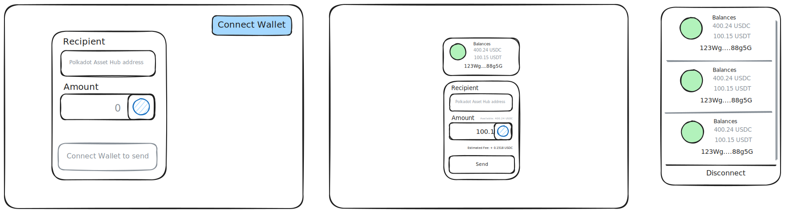

# MobyPay Web tool

Transact USDC/USDT on Polkadot Asset Hub and paying fees in USDC/USDT, no DOT required.

Works with Talisman Browser Extension, doesn't work with Polkadotjs Extension.

## Todos

- Connect Wallet
  - [x] Select wallet to connect
  - [x] Select accounts
  - [x] Disconnect wallet
  - [x] Show USDC and USDT balance
- Send component
  - [x] Recipient input
  - [x] Amount to send input
  - [x] Select USDC or USDT to send
  - [x] Display selected coin's available balance
  - [x] Fetch and auto refresh Estimated Fee (based on amount and selectedToken change)
  - [x] Pay transaction fees with USDC/USDT
- Info
  - [x] Transaction processing status (Toast)
  - [x] Error messages (Toast)
- Refactor
  - [x] Make the codebase type safe
  - [ ] Color the ui
